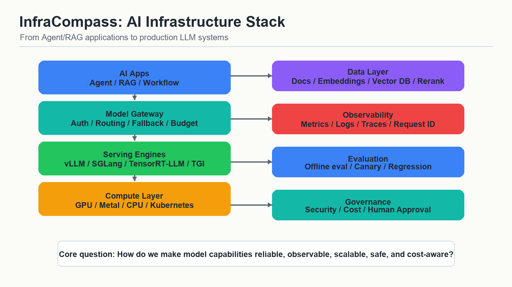
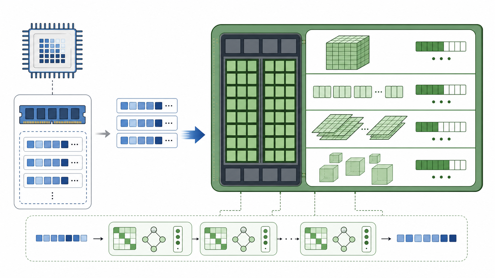
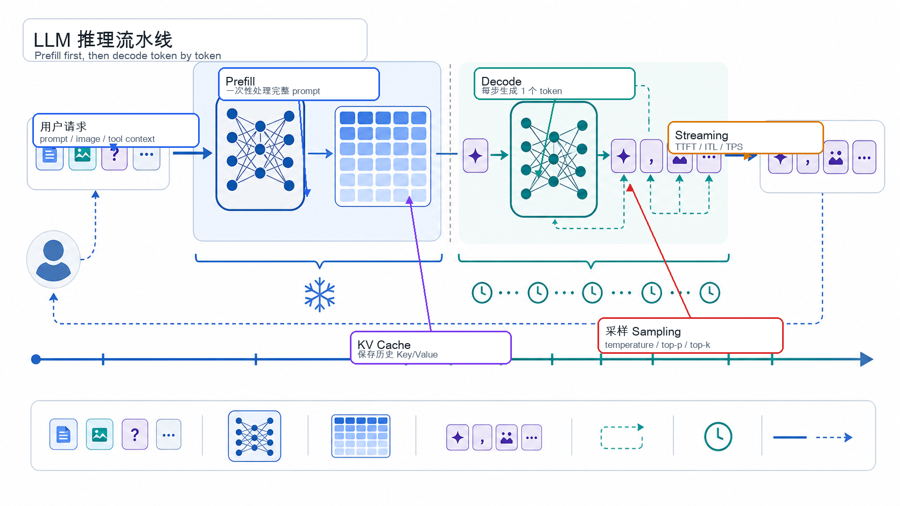
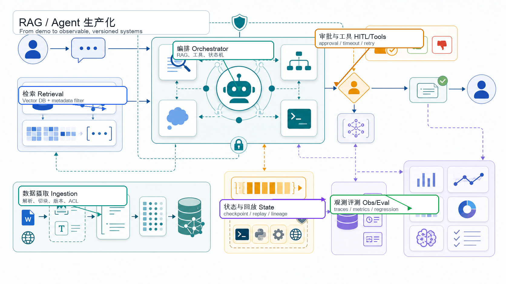

# InfraCompass for AI Builders

> 面向 AI 产品/研发、Agent/RAG 开发者的中文 AI Infra 入门教程。




## 项目简介

很多 AI 产品/研发已经能搭建 Agent 或 RAG 原型，但一进入生产问题，就会遇到一组更底层的概念：GPU 显存、KV cache、prefill/decode、推理服务、模型网关、Kubernetes、可观测性、成本治理、评测回归、工具安全。

**InfraCompass for AI Builders** 是一套中文 Notebook 教程，目标是帮助应用开发者建立 AI Infra 的系统视角。它从深度学习推理基础讲起，再逐步进入 GPU、LLM 推理机制、vLLM、Serving 框架选型、容量规划、模型网关、观测成本和 RAG/Agent 生产化。

这套教程强调可学习、可解释、可落地。每章都包含基础知识、图示、公式、代码实验、生产场景、常见误区和面试/工作表达。

## 你会学到什么

- token、tensor、embedding、attention、logits、sampling 在推理阶段如何工作。
- prefill、decode、KV cache、batching、prefix caching 为什么决定 LLM serving 的性能。
- GPU 显存如何被模型权重、KV cache、激活和 runtime workspace 消耗。
- vLLM 的系统机制：PagedAttention、scheduler、OpenAI-compatible serving、metrics、tuning。
- vLLM、SGLang、TensorRT-LLM、TGI、Ray Serve LLM、MLX、llama.cpp 如何选型。
- 如何用 QPS、并发、token 长度分布、延迟 SLO 和 GPU 副本数做容量估算。
- 模型网关如何处理 routing、fallback、virtual keys、budget、logs、metrics、traces。
- RAG/Agent 如何补齐数据版本、权限过滤、rerank、工具安全、状态管理、评测和可观测性。

## 适合谁

这套教程适合：

- 正在做 AI 产品、Agent workflow、RAG 系统或模型应用的开发者。
- 有 Python 和应用开发基础，但对深度学习推理、GPU、Serving、Kubernetes 不够熟悉的人。
- 希望在求职或工作中讲清 LLM serving、AI Infra 选型和生产治理的人。
- 使用 Mac 学习，同时希望理解云 GPU 和 Kubernetes 生产路径的人。

## 学习路径

| 章节 | Notebook | 学习目标 |
|---:|---|---|
| 00 | [AI Infra 学习地图](notebooks/00_ai_infra_learning_map.ipynb) | 建立完整地图：模型、推理、网关、数据、观测、评测、安全、成本。 |
| 01 | [深度学习推理基础](notebooks/01_deep_learning_inference_basics.ipynb) | 理解 tokenization、tensor、embedding、attention、Transformer block、logits 和 sampling。 |
| 02 | [GPU、显存与计算基础](notebooks/02_gpu_memory_compute_basics.ipynb) | 理解 CPU/GPU 分工、dtype、量化、权重显存、KV cache 和 GPU 利用率。 |
| 03 | [LLM 推理机制](notebooks/03_llm_inference_mechanics.ipynb) | 理解 prefill、decode、continuous batching、chunked prefill、prefix caching 和延迟指标。 |
| 04 | [vLLM Serving Engine](notebooks/04_vllm_serving_engine.ipynb) | 系统学习 vLLM、vLLM-Metal、PagedAttention、OpenAI-compatible serving、metrics 和 tuning。 |
| 05 | [vLLM 之外的 Serving 框架](notebooks/05_serving_frameworks_beyond_vllm.ipynb) | 对比 vLLM、SGLang、TensorRT-LLM、TGI、Ray Serve LLM、MLX 和 llama.cpp。 |
| 06 | [容量规划与 Kubernetes](notebooks/06_capacity_planning_and_kubernetes.ipynb) | 估算 GPU、replica、token pressure，理解 KServe、GPU Operator 和 autoscaling 风险。 |
| 07 | [模型网关、观测与成本](notebooks/07_gateway_observability_cost.ipynb) | 设计模型 routing、fallback、budget、OpenTelemetry-style traces、dashboard 和事故排查流程。 |
| 08 | [RAG/Agent 生产化加固](notebooks/08_rag_agent_infra_hardening.ipynb) | 将 RAG/Agent 原型升级为具备版本、权限、工具安全、状态、评测和观测能力的生产系统。 |

## 视觉导览

Notebook 中包含 Mermaid 图和项目图片，用来解释抽象的基础设施概念。

| 概念 | 预览 |
|---|---|
| AI Infra 技术栈 |  |
| GPU 显存与计算 |  |
| LLM 推理流水线 |  |
| RAG/Agent 生产化加固 |  |

## 项目结构

```text
.
├── assets/
│   └── images/                  # Notebook 使用的概念图
├── notebooks/                   # 教程主体章节
├── scripts/
│   └── validate_notebooks.py    # Notebook、Mermaid、图片、公式、代码校验
├── requirements_mac.txt         # 轻量 Notebook 依赖
└── README.md
```

## 快速开始

```bash
git clone git@github.com:Yanjieij/infra-compass-for-ai-builders.git
cd infra-compass-for-ai-builders

python3 -m venv .venv
source .venv/bin/activate
pip install -r requirements_mac.txt

jupyter lab
```

建议按 `00` 到 `08` 的顺序阅读。

## Mac 用户说明

大部分 Notebook 只依赖轻量 Python 包，不需要 GPU。第 4 章包含 vLLM/vLLM-Metal 的可选实验单元。

如果你使用 Apple Silicon Mac，可以按 [第 4 章](notebooks/04_vllm_serving_engine.ipynb) 的说明单独安装 vLLM-Metal。建议把 vLLM-Metal 环境和普通 Notebook 环境分开管理。

## 校验

运行项目校验：

```bash
python3 scripts/validate_notebooks.py
```

校验脚本会检查：

- Notebook JSON 和 `nbformat`
- Python 代码单元语法
- Mermaid 代码块结构
- 图片引用是否存在
- 常见 LaTeX / 控制字符错误
- 数学公式分隔符是否成对

## 资料来源

教程正文已经吸收并解释关键内容。下面链接用于核对最新细节和延伸阅读：

- [vLLM](https://docs.vllm.ai/en/latest/)
- [vLLM-Metal](https://docs.vllm.ai/projects/vllm-metal/en/latest/)
- [Ray Serve LLM](https://docs.ray.io/en/latest/serve/llm/index.html)
- [SGLang](https://docs.sglang.io/)
- [NVIDIA TensorRT-LLM](https://docs.nvidia.com/tensorrt-llm/)
- [Hugging Face Text Generation Inference](https://huggingface.co/docs/text-generation-inference/index)
- [LiteLLM](https://docs.litellm.ai/)
- [KServe](https://kserve.github.io/website/)
- [NVIDIA GPU Operator](https://docs.nvidia.com/datacenter/cloud-native/gpu-operator/latest/)
- [OpenTelemetry GenAI Semantic Conventions](https://opentelemetry.io/docs/specs/semconv/gen-ai/)

## 当前状态

这是一个持续更新的学习项目。当前版本聚焦 AI 产品/研发需要掌握的基础概念、可运行实验和生产化心智模型。

